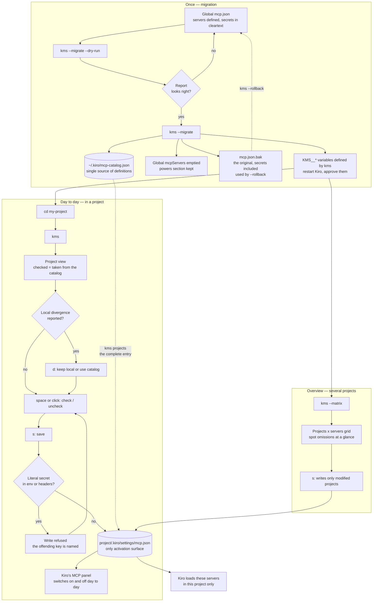

# kiro-mcp-scope

[](https://github.com/shaffe-fr/kiro-mcp-scope/actions/workflows/ci.yml)
[](LICENSE)

`kms` scopes your MCP servers to the projects that need them in
[Kiro](https://kiro.dev). You define each server once, in a local catalog, and
pick per project which ones it gets — from a TUI or the command line.

Developed and tested on Windows. macOS and Linux are supported, with less
real-world testing.

## The problem

In Kiro, the **definition** of an MCP server and its **activation** live in the
same place: `disabled` sits right next to `command`. A server defined in the
global `mcp.json` (`~/.kiro/settings/mcp.json`) is therefore active in every
project, or in none.

Kiro has no "defined globally, active in this project only" mechanism: no
`$include`, no `extends`, no inheritance between agents. Precedence goes
`Agent > Workspace > Global`, additive when names differ and **full
replacement** when a name matches. A lower scope can never re-enable a server
that a higher scope disabled.

## The model

kms moves definitions out of Kiro into a neutral **catalog** that Kiro never
reads, and projects catalog entries into a project's `mcp.json` on demand.

```
~/.kiro/mcp-catalog.json          catalog: the single source of definitions
        │
        │  kms projects a complete entry
        ▼
<project>/.kiro/settings/mcp.json the only activation surface
```

Two rules hold the whole model together:

1. The **global** `mcp.json` no longer contains any optional server. Leave it
   alone, both by hand and through Kiro's MCP panel.
2. Making a server available in a project means writing its **complete** entry
   into that project's `mcp.json`; removing it means deleting that entry. Since
   Kiro overrides by name with full replacement, a bare `"disabled": false`
   would not be enough: the whole entry is needed.

## Who does what

Kiro can already switch a server on and off, with a dedicated panel. What it
cannot do is bring a definition from a shared library into a given project: its
panel only toggles what is already declared, and toggling a global entry toggles
it for **every** project.

Hence the split:

| | Responsibility |
|---|---|
| **kms** | what is **present** in the project's `mcp.json` |
| **Kiro's MCP panel** | what is **switched on** among what is present |

The `disabled` field therefore belongs to Kiro. In the catalog it only serves as
the **initial state**, applied when the entry is first projected into a project.
After that kms never touches it and preserves whatever Kiro wrote there.

A checked box in kms means "taken from the catalog for this project", not
"switched on right now".

## Workflow



To script or check without opening the TUI: `--list`, `--status`,
`--discover`, `--activate <name>`, `--deactivate <name>`. To go back:
`--rollback`.

## Guarantees

- Entries of a project `mcp.json` that the catalog does not know are
  **preserved** as they are.
- **Idempotent** writes: re-applying the same state does not modify the file, so
  git diffs stay quiet.
- **Stable** JSON: two-space indent, deterministic key order, trailing newline.
- A local tweak that **diverges** from the catalog is never silently
  overwritten: the divergence is reported, and you choose to keep or overwrite.
- The `disabled` field of an entry already present is **preserved**: what you
  switch off in Kiro is not switched back on at the next save.

## The `${VAR}` convention and secrets

A project `mcp.json` is meant to be versioned, and writing a secret into it in
cleartext would expose it. kms therefore **refuses** to write an `env` or
`headers` value it cannot establish as harmless.

The only accepted form for a sensitive value is `${VARIABLE_NAME}`, which Kiro
resolves from the environment. When a write is refused, the message names the
offending key, never its value.

The check relies on **no list of providers**: a list of known formats goes stale
with every new service and silently lets through whatever it does not know.
Three generic rules apply, in order:

1. Every `${IDENTIFIER}` reference is removed from the value before analysis.
   Only the residue matters — what would end up in cleartext in the file. So
   `${TOKEN}` leaves nothing, and `Bearer ${TOKEN}` leaves `Bearer `.
2. If the **key name** suggests a credential — `token`, `secret`, `key`,
   `password`, `auth`, `credential`, `bearer`, `session`, `cookie`,
   `private` — any non-empty residue is refused. This is what catches a short
   password that no entropy measure would flag.
3. Otherwise the residue is refused if it is long, high-entropy, has no space,
   and looks like neither a path nor a URL.

A credential from a service never seen before is still caught: by rule 3 if it
is random, by rule 2 if the key name gives it away.

The check does not depend on the kind of entry: a credential in the `env` of a
local server is detected just like an `Authorization` in the `headers` of a
remote one.

For Kiro to resolve a variable:

1. it must exist in Kiro's environment — `kms --migrate` takes care of that for
   the secrets it extracts (see [Migration](#migrating-from-the-global-mcpjson));
2. it must be approved in Kiro, which only expands allowed variables: Kiro
   offers to approve them when it loads an `mcp.json` referencing a new one.
   Kiro's documentation calls this setting "Mcp Approved Env Vars"; depending on
   the version it may not show under that name in the settings.

## Installation

kms is a single binary with no runtime.

Prebuilt binaries for Windows, Linux and macOS are attached to each
[release](https://github.com/shaffe-fr/kiro-mcp-scope/releases), with a
`SHA256SUMS` file. Extract `kms` (or `kms.exe`) to a directory on your `PATH`.

Or build and install it with Cargo:

```bash
cargo install --git https://github.com/shaffe-fr/kiro-mcp-scope
```

This puts `kms` in `~/.cargo/bin`, which is on your `PATH` with a standard Rust
setup. To build from a clone instead, run `cargo build --release`: the binary is
then at `target/release/kms.exe` (Windows) or `target/release/kms` (elsewhere).

Files kms reads:

| File | Role |
|---|---|
| `~/.kiro/mcp-catalog.json` | the catalog, source of definitions |
| `~/.kiro/mcp-catalog.config.json` | kms's own config: roots to scan, depth |
| `~/.kiro/settings/mcp.json` | the global `mcp.json`, read only (except by `--migrate` and `--rollback`) |
| `~/.kiro/settings/mcp.json.bak` | the original kept by `--migrate`, secrets included |
| `~/.kiro/kms-env.sh` | outside Windows: the `KMS__*` variables, sourced from the shell profile |
| `<project>/.kiro/settings/mcp.json` | a project's activation surface |

## Command line

Without arguments kms opens the project view (TUI). Options cover the rest:

| Command | Effect |
|---|---|
| `kms` | open the project view (TUI) |
| `kms --matrix` | open the matrix view (projects × servers) |
| `kms --list` | list catalog servers and their state in this project |
| `kms --status` | like `--list`, plus the global drift warning |
| `kms --discover` | list detected Kiro projects and how many servers each takes |
| `kms --activate <name>` | take a catalog server into this project |
| `kms --deactivate <name>` | remove a server from this project |
| `kms --migrate` | move the global servers into the catalog, and their secrets into `KMS__*` variables |
| `kms --migrate --no-env` | the same, without touching environment variables |
| `kms --rollback` | return to the global `mcp.json` from the backup |
| `--dry-run` | with `--migrate` or `--rollback`: show what would happen, change nothing |
| `kms --help` | show help |
| `kms --version` | show the version |

`--activate` and `--deactivate` are a scripting convenience: on a divergence
they overwrite with the catalog definition. Case-by-case resolution (keep ↔
overwrite) is the TUI's job.

States shown by `--list`:

- `[ ]` absent from the project;
- `[x]` present and matching the catalog;
- `[!]` present but diverging, with the list of differing fields;
- `— off in Kiro` marks an entry switched off in Kiro's MCP panel.

## The two TUI views

`Tab` switches between the project view and the matrix view without losing
checks: pending selections live in memory until you save.

### Project view

The catalog for the current project. A checked box means taken from the catalog
for this project.

| Key / mouse | Effect |
|---|---|
| `↑` `↓` or `k` `j` | move the cursor |
| `Space` / `Enter` / click | check / uncheck the row |
| `d` | on a divergence, toggle keep local ↔ use catalog |
| `s` | save |
| wheel | move the cursor |
| `Tab` | switch to the matrix view |
| `q` or `Ctrl+C` | quit |

`*unsaved*` in the header marks unsaved changes.

### Matrix view

A projects × servers grid to see at a glance where a server is missing.

| Key / mouse | Effect |
|---|---|
| `↑` `↓` or `k` `j` | change project |
| `←` `→` or `h` `l` | change server |
| `Space` / `Enter` / click | check / uncheck the cell |
| `s` | save — writes only modified projects |
| wheel | change project |
| `Tab` | back to the project view |
| `q` or `Ctrl+C` | quit |

A `[!]` cell marks a local divergence in that project.

## Discovery configuration

Without `mcp-catalog.config.json`, kms scans the current directory and its
parent. To search further, list roots and a depth:

```json
{
  "roots": ["~/code", "~/work"],
  "maxDepth": 2
}
```

`maxDepth` bounds the descent under each root (2 by default, the root itself
being depth 0). A leading `~` expands to the home directory.

## Migrating from the global mcp.json

Done once, to move from a global `mcp.json` that activates everywhere to a
catalog projected project by project.

The first time `kms` runs in a terminal with no catalog yet and servers in the
global file, it shows what the migration would do and offers to run it
(`[Y/n]`, yes by default). Outside a terminal — in a script — it asks nothing
and points to `kms --migrate`.

1. Preview without changing anything:

   ```bash
   kms --migrate --dry-run
   ```

   The report lists the servers going into the catalog, the extracted secrets
   and the variables that will be defined. It names variables, never values.

2. Run the migration:

   ```bash
   kms --migrate
   ```

   Without asking anything, kms:

   - keeps the original as `~/.kiro/settings/mcp.json.bak`;
   - writes the catalog, with secrets replaced by `${KMS__…}` references;
   - empties the global `mcpServers`, keeping `powers` and the other keys;
   - defines each `KMS__…` variable with its value.

3. Restart Kiro — and the terminal you launch it from, if any — so it sees the
   new variables, then approve them when Kiro asks.

The migration runs only once: run again, it refuses, so the backup of the
original is never overwritten. A catalog present **without** a `.bak` next to
it — written by hand, or left over from a manual restore — does not come from a
migration: `--migrate` sets it aside as `mcp-catalog.json.before-migrate`,
without deleting it, and migrates as usual.

### Where the variables go

| System | Location |
|---|---|
| Windows | user environment variables |
| macOS, Linux | `~/.kiro/kms-env.sh`, readable by you only |

Outside Windows, add this once to your shell profile (`~/.zshrc`, `~/.bashrc`…):

```bash
. "$HOME/.kiro/kms-env.sh"
```

kms never edits your profile itself. To migrate without touching variables, use
`kms --migrate --no-env`: the report lists the ones to define, and their values
are in the `.bak`.

### Variable naming

One variable per server and per key where a secret was found, named
`KMS__<SERVER>__<KEY>`: `env.AUTH_HEADER` of the server `Remote-MCP-A` gives

```json
"AUTH_HEADER": "${KMS__REMOTE_MCP_A__AUTH_HEADER}"
```

The key on the left does not change: it is the name the MCP server expects. Two
servers holding the same token today each get their own variable, so one can be
rotated without touching the others.

Server and key names are uppercased, and anything that is neither a letter nor
a digit becomes a single `_` (`X-Api-Key` → `X_API_KEY`). The double `__`
therefore only separates prefix, server and key. If two names still collide
after normalization (`svc-a` and `svc_a`), the second gets a `_2` suffix.

The prefix marks the variables that belong to kms: it is what lets the rollback
remove its own without touching yours.

### Good to know

- **The `.bak` backup holds the secrets in cleartext.** Do not version it. Keep
  it: it is what `--rollback` restores.
- **The `disabled` state is not carried over.** Entries arrive in the catalog
  normalized to active. Edit the catalog by hand for servers you would rather
  see arrive switched off.

## Going back to the global model

```bash
kms --rollback --dry-run   # see what would be undone
kms --rollback
```

From the `.bak` backup, kms:

- puts the servers back into the global `mcp.json`. Other keys keep their
  current state (Kiro may have updated `powers` since), and a server added to
  the global after the migration is kept;
- sets the catalog aside as `mcp-catalog.json.rolledback`, without deleting it:
  whatever you added to it in the meantime stays recoverable;
- removes the `KMS__…` variables the migration defined, and only those;
- keeps the `.bak` backup.

Project `mcp.json` files are not modified. A project entry replaces the global
entry of the same name: a project still referencing `${KMS__…}` will no longer
start that server. The rollback lists those projects; removing or fixing those
entries is up to you.

After a rollback, `kms --migrate` is possible again.

## License

[MIT](LICENSE)
