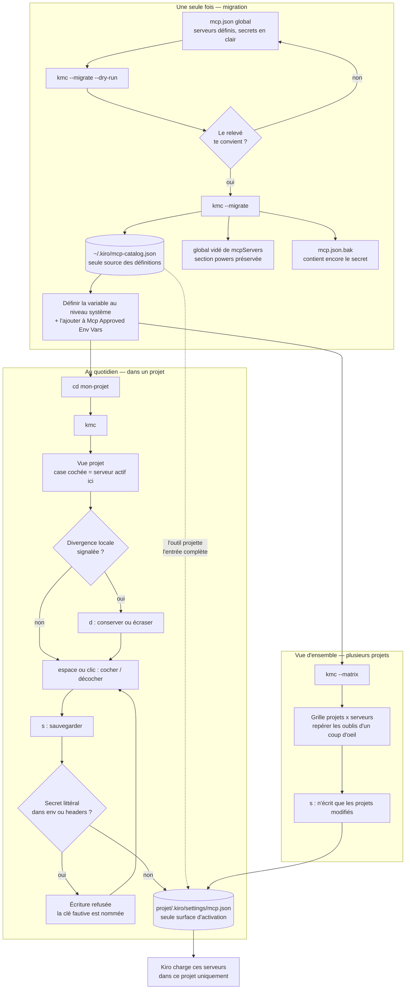

# Spike Go — Bubble Tea, taille du binaire et souris

## Comment lancer

```bash
go run .
```

Ou avec le binaire compilé :

```bash
./spike-go.exe
```

Attendu : une liste de cinq cases (`alpha`, `bravo`, `charlie`, `delta`, `echo`),
la ligne du curseur surlignée, en plein écran.

- Clic sur une ligne : coche/décoche et déplace le curseur.
- Molette : déplace le curseur.
- Flèches / `j` `k` : déplacent le curseur.
- Espace ou Entrée : coche/décoche la ligne courante.
- `q` ou Ctrl+C : quitte.

Comportement identique au spike OpenTUI (`spike/spike.tsx`), pour comparaison
directe.

## Stack

- [Bubble Tea](https://github.com/charmbracelet/bubbletea) v1.3.10 (modèle
  Elm : `Init`/`Update`/`View`)
- [Lipgloss](https://github.com/charmbracelet/lipgloss) v1.1.0 pour les couleurs
- `tea.WithAltScreen()` + `tea.WithMouseCellMotion()`

## Vérifié automatiquement

- `go vet ./...` : passe.
- `go build -ldflags="-s -w" -trimpath` : compile, binaire `PE32+ x86-64`
  valide.

## Taille du binaire — résultat principal

| Binaire | Taille | Contenu embarqué |
|---|---|---|
| `kmc.exe` (Bun + OpenTUI, actuel) | 112 Mo | runtime Bun + moteur natif OpenTUI |
| `spike-go.exe` (Go + Bubble Tea, release) | **3,4 Mo** | binaire Go statique |

Facteur ~33x. Go compile en binaire statique sans runtime embarqué,
contrairement à `bun build --compile` qui embarque l'intégralité du runtime JS.

Ce résultat n'a jamais été remis en cause par les problèmes de souris ci-dessous.

## Souris : enquête

### Symptômes initiaux

- Terminal intégré de Kiro : aucune réaction à la souris.
- Windows Terminal : le clic cochait puis décochait immédiatement.

### Cause 1 — double événement press/release (résolu)

Un clic gauche produit un événement press **et** un release. Le code d'origine
ne filtrait que sur le bouton, pas sur l'action, donc chaque clic basculait
deux fois. Corrigé en n'agissant que sur `MouseActionPress`.

Cela a réglé Windows Terminal et le terminal standalone, pas Kiro.

### Deux pistes explorées puis écartées

Ces deux hypothèses se sont révélées fausses ; elles sont conservées ici parce
que leur réfutation est ce qui a mené à la vraie cause.

**Séquence `?1000h` manquante.** OpenTUI émet `?1000h` en plus de
`?1002h`/`?1006h` (`packages/native/src/terminal.zig`, `setMouseMode`), Bubble
Tea jamais. Émettre `?1000h` à la main n'a rien changé.

**Modes souris effacés au changement de focus.** OpenTUI réémet toutes les
séquences sur focus-in (`restoreTerminalModes`, et `focusHandler` dans
`packages/core/src/renderer.ts`) parce que certains terminaux les suppriment.
Répliquer ce mécanisme via `tea.EnableReportFocus` + `tea.FocusMsg` n'a rien
changé non plus.

Raison structurelle de ces deux échecs, trouvée dans `key_windows.go` :

```go
func readInputs(ctx context.Context, msgs chan<- Msg, input io.Reader) error {
	if coninReader, ok := input.(*conInputReader); ok {
		return readConInputs(ctx, msgs, coninReader)   // chemin CONSOLE
	}
	return readAnsiInputs(ctx, msgs, localereader.NewReader(input)) // chemin ANSI
}
```

Sur Windows avec un handle console utilisable, Bubble Tea prend le chemin
console : la souris vient de `MOUSE_EVENT_RECORD`, les séquences ANSI mouse
sont sans effet, et aucun `FocusMsg` n'est jamais produit (`FocusMsg` n'existe
que dans le parseur ANSI). Les deux correctifs étaient donc du code mort par
construction — ils ne pouvaient pas s'exécuter.

### Diagnostic instrumenté

`diag/main.go` reproduit la décision de Bubble Tea, applique le même jeu de
modes console, et journalise chaque événement reçu.

```bash
go build -o diag/diag.exe ./diag
./diag/diag.exe        # cliquer, scroller, puis q
```

Résultats (25/09/2026), **les deux terminaux délivrent bien la souris** :

| | Windows Terminal | Kiro intégré |
|---|---|---|
| chemin d'input | console | console |
| `ENABLE_MOUSE_INPUT` appliqué | oui | oui |
| enregistrements souris reçus | 15 | 24 |
| état des boutons pendant un déplacement | `No Button` | **`Right`** |

Cela invalide l'hypothèse « ConPTY ne relaie pas la souris » : Kiro reçoit
*plus* d'événements que Windows Terminal.

### Cause 2 — état de bouton parasite chez Kiro (résolu)

Kiro signale le bouton droit comme enfoncé pendant les simples déplacements.
Or Bubble Tea déduit le bouton par un XOR entre état précédent et courant
(`mouseEventButton`) :

```go
btn := p ^ s
switch btn {
case coninput.FROM_LEFT_1ST_BUTTON_PRESSED: button = MouseButtonLeft
case coninput.RIGHTMOST_BUTTON_PRESSED:     button = MouseButtonRight
// ...
}
```

- Windows Terminal : `p=0x00`, `s=0x01` → `btn=0x01` → `MouseButtonLeft`.
- Kiro : `p=0x02`, `s=0x01` → `btn=0x03` → **aucun `case` ne correspond**,
  `Button` reste `MouseButtonNone`.

Le clic arrive donc bien, avec `Action=Press`, mais sans bouton identifiable.
Un `switch` sur `MouseButtonLeft` l'ignore silencieusement. C'est une limite du
XOR de Bubble Tea, incapable d'exprimer deux transitions simultanées.

Corrigé par `isLeftPress()` : une pression non étiquetée (`MouseButtonNone`)
compte comme clic gauche.

### Cause 3 — coordonnées absolues sans écran alternatif (résolu)

`mouseEvent` transmet la coordonnée brute : `ev.Y = int(e.MousePositon.Y)`,
c'est-à-dire la ligne dans le buffer console. Le spike calculait
`row := event.Y - 2` en supposant le titre en ligne 0 du buffer — vrai
uniquement si le programme démarre tout en haut. Dès qu'il y a de l'historique
au-dessus (cas normal dans un terminal intégré déjà utilisé), `row` tombe hors
de `[0, 5)` et les clics sont ignorés sans rien afficher.

OpenTUI n'a pas ce problème : il ouvre l'écran alternatif par défaut
(`screenMode`, valeur par défaut `"alternate-screen"` dans
`packages/core/src/renderer.ts`), où Y correspond directement aux lignes
rendues.

Corrigé en ajoutant `tea.WithAltScreen()`.

## Verdict

- **Taille** : 3,4 Mo contre 112 Mo, acquis.
- **Souris** : les trois causes identifiées étaient dans le code du spike ou
  dans la façon dont Bubble Tea traduit l'input Windows, pas dans une
  limitation du terminal de Kiro. Ce terminal relaie correctement la souris.
- **Pour un portage réel**, deux points à retenir : toujours utiliser l'écran
  alternatif si on lit des coordonnées souris, et ne pas se fier au seul champ
  `Button` de Bubble Tea sur Windows (l'état parasite de Kiro le rend
  inexploitable tel quel).

### À retester

- [ ] Terminal intégré de Kiro : clic coche la bonne ligne, molette déplace le
      curseur
- [ ] Windows Terminal / standalone : pas de régression (clic simple, pas de
      double bascule)

